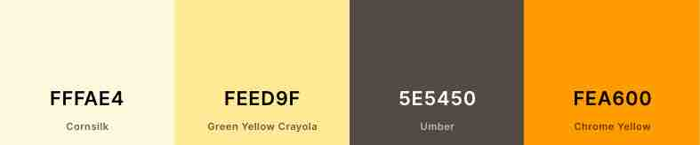
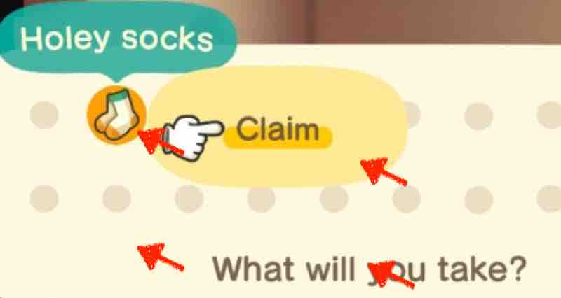
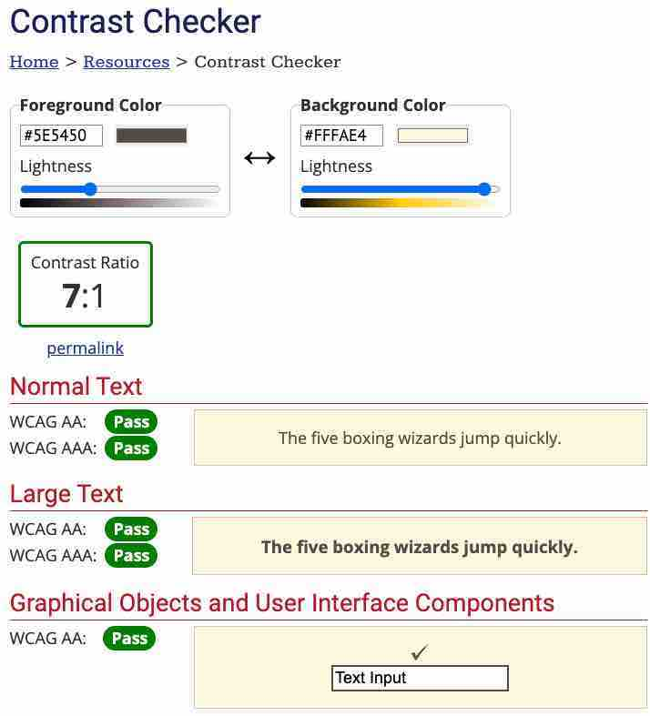

# Trading Paradise Website

"Trading Paradise" is a marketplace for the [Animal Crossing: New Horizons (ACNH)](https://en.wikipedia.org/wiki/Animal_Crossing:_New_Horizons) player. The site will be targeted toward other ACNH players who are interested in trading in-game items and have [Nintendo Switch online membership](https://www.nintendo.com/switch/online-service/). The main goal of this website is for users to contact "Trading Paradise" for trading in-game items.

 

# Table of Contents

This project has just begun, the content of this document will be added as the project is progressing.

#### [User Experience (UX)](<#user-experience-(ux)>)

- [User Stories](#user-stories)
- [Design](#design)
- [Wireframes / Mockups](#wireframes--mockups)

 

# User Experience (UX)

## User Stories

- As a First Time Visitor,

  - I want to know what this site is about immediately, so that I can quickly decide whether I want to explore it more.
  - I want to be able to navigate pages easily, so that I don't have to waste my time.
  - I want to check their social media, so that I can determine whether they are trustworthy.
    
     

- As a Returning Visitor,

  - I want to see the site on my phone nicely, so that I can visit it on my way home on the bus.
  - I want to know easily if items that I want to buy are available, so that I don't have to browse the whole page.
  - I want to be able to contact them, so that I can ask questions before trading.

     

- As a Frequent User,

  - I want to be friends with them, so that I can participate in more events and shooting star wishes.
  - I want to get notified when there are updates on available items, so that I can get them before someone else.
  - I want to be able to add items to my wish list, so that I can find them faster at a later date.

   

## Design

The site is designed to look familiar to ACNH. Users can be more comfortable with familiar environments, which will let them stay on the site longer and be more likely to end up trading. Colours, typography and images are chosen with that in mind.

- Colour Scheme
  - Colours are adopted from speech bubbles in the game.
  
    - Background colours: #fffae4(Cornsilk), #feed9f(Green Yellow Crayola)
    - Text colour: #5e5450(Umber)
    - Accent colour: #fea600(Chrome Yellow)

     

  - Each hex colour code was found the following steps:

    1.  Take a screenshot on the game screen.
    2.  Go to [HTML Color Codes](https://html-color-codes.info/colors-from-image/)
    3.  Place the mouse cursor where desired colours are.
     

    

    4.  Get hex codes.
    5.  Go to [WebAIM](https://webaim.org/resources/contrastchecker/).
    6.  Check the contrast between background and text and adjust the lightness of the text colour for the accessibility purpose.
     
    
    

     

- Typography

  - Fonts are adopted from the [ACNH official website](https://www.animal-crossing.com/new-horizons/) instead of in-game fonts due to licence fee.
    - Headings: [Zilla Slab](https://fonts.google.com/specimen/Zilla+Slab) is used with Serif as the fallback font. It is characterised by bold appearance and smooth curves, so it looks more contemporary and joyful than other serif types.
    - Paragraph: [Libre Franklin](https://fonts.google.com/specimen/Libre+Franklin) is used in body text with Sans Serif as the fall back. It is often perceived as more friendly and warmer than other sans serif types.
  - Fonts on the ACNH official website are identified by Chrome extension [WhatFont](https://chrome.google.com/webstore/detail/whatfont/jabopobgcpjmedljpbcaablpmlmfcogm) and Chrome developer tool.

     

- Imagery

  - Using ACNH imagery is important to make users comfortable by being similar to ACNH, whereas having unrelated imagery would be confusing.
  - ACNH logo is used on the landing page to let users immediately know that this site is about ACNH.
  - Game Characters are used on the landing, about, success and error page.
  - Item images are used on the trade page to help users recognise items easily even if they don't know the exact name.
  - A leaf pattern background is used throughout the site. The green leaf is representing an item when it's on the ground.

     

- Logo

  - The logo has the website name "Trading Paradise" inside the Nintendo Switch console image.
  - The user will recognise the console in the logo by its shape and colour.
  - [Canva](https://www.canva.com/) was used to design the logo.
   

    
    
   

## Wireframes / Mockups
- Mobile Wireframes
  - [View Landing Page](readme-images/mobile-wireframes/landing.jpeg)
  - [View About Page](readme-images/mobile-wireframes/about.jpeg)
  - [View Trade Page](readme-images/mobile-wireframes/trade.jpeg)
  - [View Contact Page](readme-images/mobile-wireframes/contact.jpeg)
  - [View Success Page](readme-images/mobile-wireframes/success.jpeg)
  - [View Error Page](readme-images/mobile-wireframes/error.jpeg)
- Mobile Mockups
  - [View Landing Page](readme-images/mobile-mockup/landing.jpeg)
  - [View About Page](readme-images/mobile-mockup/about.jpeg)
  - [View Trade Page](readme-images/mobile-mockup/trade.jpeg)
  - [View Contact Page](readme-images/mobile-mockup/contact.jpeg)
  - [View Success Page](readme-images/mobile-mockup/success.jpeg)
  - [View Error Page](readme-images/mobile-mockup/error.jpeg)
- Tablet Wireframes
  - [View Landing Page](readme-images/tablet-wireframes/landing.jpeg)
  - [View About Page](readme-images/tablet-wireframes/about.jpeg)
  - [View Trade Page](readme-images/tablet-wireframes/trade.jpeg)
  - [View Contact Page](readme-images/tablet-wireframes/contact.jpeg)
  - [View Success Page](readme-images/tablet-wireframes/success.jpeg)
  - [View Error Page](readme-images/tablet-wireframes/error.jpeg)
- Desktop Wireframes
  - [View Landing Page](readme-images/desktop-wireframes/landing.jpeg)
  - [View About Page](readme-images/desktop-wireframes/about.jpeg)
  - [View Trade Page](readme-images/desktop-wireframes/trade.jpeg)
  - [View Contact Page](readme-images/desktop-wireframes/contact.jpeg)
  - [View Success Page](readme-images/desktop-wireframes/success.jpeg)
  - [View Error Page](readme-images/desktop-wireframes/error.jpeg)
    