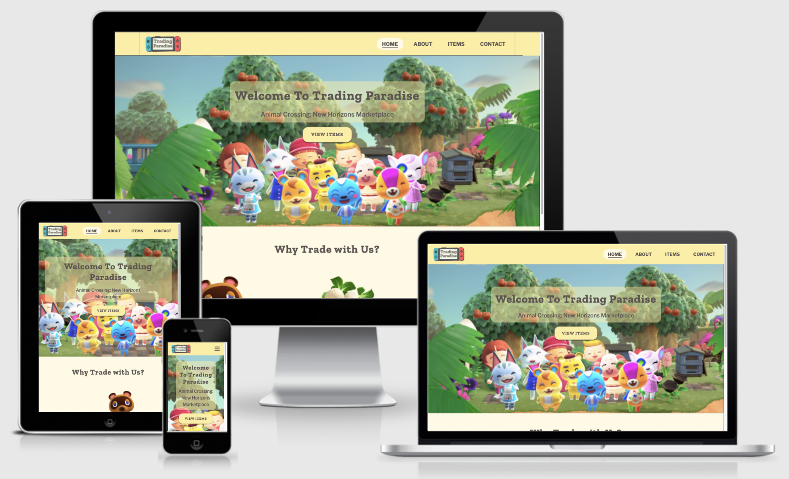
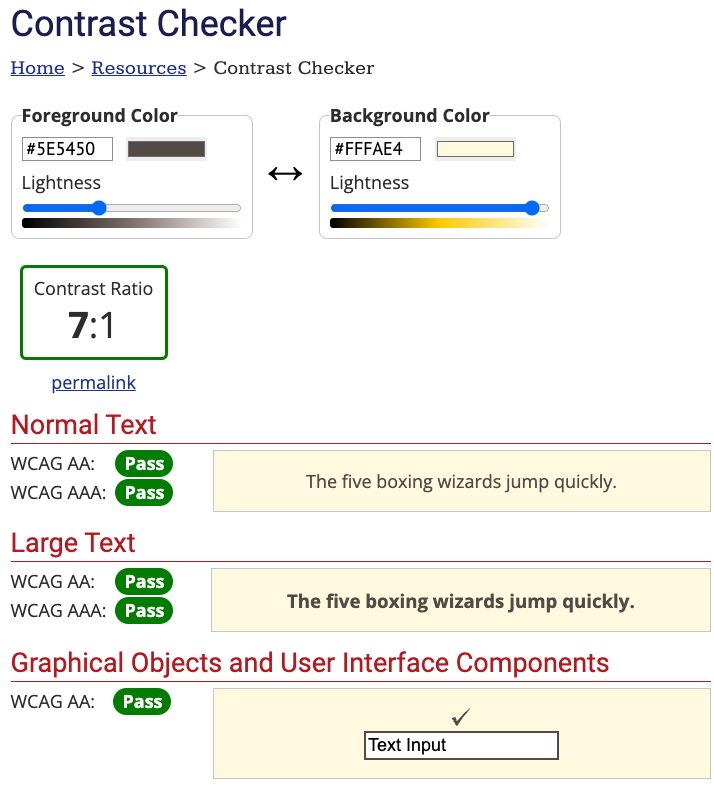
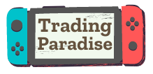
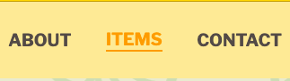
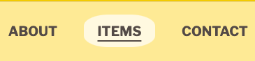
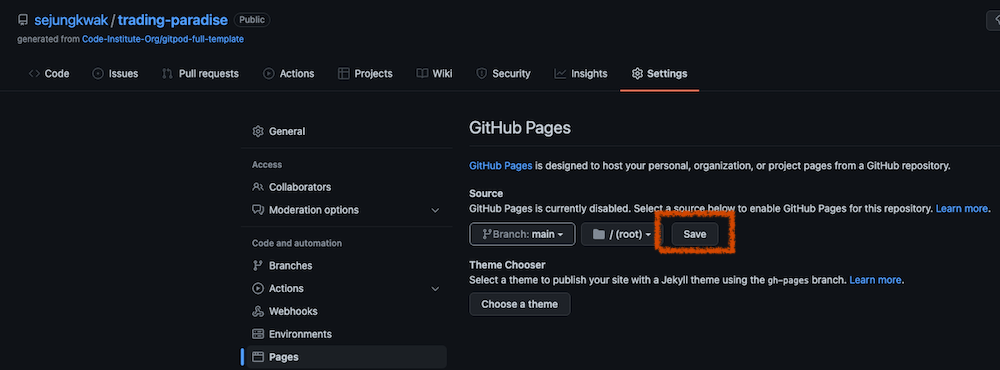
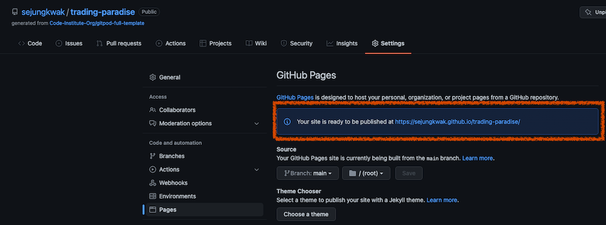
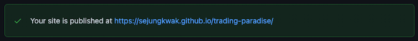

# Trading Paradise Website

_Trading Paradise_ is a marketplace for the [Animal Crossing: New Horizons (ACNH)](https://en.wikipedia.org/wiki/Animal_Crossing:_New_Horizons) player. The site will be targeted towards other ACNH players who are interested in trading in-game items and have [Nintendo Switch online membership](https://www.nintendo.com/switch/online-service/). The main goal of this website is for users to contact _Trading Paradise_ for trading in-game items. It is designed to be responsive and accessible on a range of devices.

[View the live project here](https://sejungkwak.github.io/trading-paradise/)

 

# Table of Contents

[User Experience (UX)](#user-experience-ux)
  - [User Stories](#user-stories)
  - [Design](#design)
  - [Wireframes / Mockups](#wireframes--mockups)

[Features](#features)
  - [Implemented Features](#implemented-features)
  - [Features Left to Implement](#features-left-to-implement)

[Technologies Used](#technologies-used)

- [Languages](#languages)
- [Programs](#programs)

[Testing](#testing)

- [Bugs](#bugs)

[Deployment](#deployment)

- [Github Pages](#github-pages)

[Credits](#credits)

- [Code](#code)
- [Content](#content)
- [Images](#images)
- [Inspiration](#inspiration)

 

# User Experience (UX)

## User Stories

- As a First Time Visitor,

  - I want to know what this site is about immediately, so that I can quickly decide whether I want to explore it more.
  - I want to be able to navigate pages easily, so that I don't have to waste my time.
  - I want to check their social media, so that I can determine whether they are trustworthy.
    
     

- As a Returning Visitor,

  - I want to see the site on my phone nicely, so that I can visit it on my way home on the bus.
  - I want to know easily if items that I want to buy are available, so that I don't have to browse the whole page.
  - I want to be able to contact them, so that I can ask questions before trading.

     

- As a Frequent User,

  - I want to be friends with them, so that I can participate in more events and shooting star wishes.
  - I want to get notified when there are updates on available items, so that I can get them before someone else.
  - I want to be able to add items to my wish list, so that I can find them faster at a later date.

   

## Design

The site is designed to look familiar to ACNH. Users can be more comfortable with familiar environments, which will let them stay on the site longer and be more likely to end up trading. Colours, typography and images are chosen with that in mind.

- Colour Scheme
  - Colours are adopted from speech bubbles in the game.
  
    - Background colours: #fffae4(Cornsilk), #feed9f(Green Yellow Crayola)
    - Text colour: #5e5450(Umber)
    - Accent colour: #fea600(Chrome Yellow)

     

  - Each hex colour code was found the following steps:

    1.  Take a screenshot on the game screen.
    2.  Go to [HTML Color Codes](https://html-color-codes.info/colors-from-image/)
    3.  Place the mouse cursor where desired colours are.
     

    

    4.  Get hex codes.
    5.  Go to [WebAIM](https://webaim.org/resources/contrastchecker/).
    6.  Check the contrast between background and text and adjust the lightness of the text colour for the accessibility purpose.
     
    
    

     

- Typography

  - Fonts are adopted from the [ACNH official website](https://www.animal-crossing.com/new-horizons/) instead of in-game fonts due to licence fee.
    - Headings: [Zilla Slab](https://fonts.google.com/specimen/Zilla+Slab) is used with Serif as the fallback font. It is characterised by bold appearance and smooth curves, so it looks more contemporary and joyful than other serif types.
    - Paragraph: [Libre Franklin](https://fonts.google.com/specimen/Libre+Franklin) is used in body text with Sans Serif as the fall back. It is often perceived as more friendly and warmer than other sans serif types.
  - Fonts on the ACNH official website are identified by Chrome extension [WhatFont](https://chrome.google.com/webstore/detail/whatfont/jabopobgcpjmedljpbcaablpmlmfcogm) and Chrome developer tool.

     

- Imagery

  - Using ACNH imagery is important to make users comfortable by being similar to ACNH, whereas having unrelated imagery would be confusing.
  - Game Characters are used on the Home, About, Success and Error page.
  - Item images are used on the Items page to help users recognise items easily even if they don't know the exact name.
  - A leaf pattern background is used throughout the site. The green leaf is representing an item when it's on the ground.

     

- Logo

  - The logo has the website name _Trading Paradise_ inside the Nintendo Switch console image.
  - The user will recognise the console in the logo by its shape and colour.
  - [Canva](https://www.canva.com/) was used to design the logo.
   

    
    
   

## Wireframes / Mockups
- Mobile
  - [View Home Page Wireframe](documentation/wireframes/mobile/home.png) / [View Home Page Mockup](documentation/mockups/mobile/home.png)
  - [View About Page Wireframe](documentation/wireframes/mobile/about.png) / [View About Page Mockup](documentation/mockups/mobile/about.png)
  - [View Items Page Wireframe](documentation/wireframes/mobile/items.png) / [View Items Page Mockup](documentation/mockups/mobile/items.png)
  - [View Contact Page Wireframe](documentation/wireframes/mobile/contact.png) / [View Contact Page Mockup](documentation/mockups/mobile/contact.png)
  - [View Success/Error Page Wireframe](documentation/wireframes/mobile/success+error.png) / [View Success Page Mockup](documentation/mockups/mobile/success.png) / [View Error Page Mockup](documentation/mockups/mobile/error.png)
- Tablet
  - [View Home Page Wireframe](documentation/wireframes/tablet/home.png) / [View Home Page Mockup](documentation/mockups/tablet/home.png)
  - [View About Page Wireframe](documentation/wireframes/tablet/about.png) / [View About Page Mockup](documentation/mockups/tablet/about.png)
  - [View Items Page Wireframe](documentation/wireframes/tablet/items.png) / [View Items Page Mockup](documentation/mockups/tablet/items.png)
  - [View Contact Page Wireframe](documentation/wireframes/tablet/contact.png) / [View Contact Page Mockup](documentation/mockups/tablet/contact.png)
  - [View Success/Error Page Wireframe](documentation/wireframes/tablet/success+error.png) / [View Success Page Mockup](documentation/mockups/tablet/success.png) / [View Error Page Mockup](documentation/mockups/tablet/error.png)
- Desktop
  - [View Home Page Wireframe](documentation/wireframes/desktop/home.png) / [View Home Page Mockup](documentation/mockups/desktop/home.png)
  - [View About Page Wireframe](documentation/wireframes/desktop/about.png) / [View About Page Mockup](documentation/mockups/desktop/about.png)
  - [View Items Page Wireframe](documentation/wireframes/desktop/items.png) / [View Items Page Mockup](documentation/mockups/desktop/items.png)
  - [View Contact Page Wireframe](documentation/wireframes/desktop/contact.png) / [View Contact Page Mockup](documentation/mockups/desktop/contact.png)
  - [View Success/Error Page Wireframe](documentation/wireframes/desktop/success+error.png) / [View Success Page Mockup](documentation/mockups/desktop/success.png) / [View Error Page Mockup](documentation/mockups/desktop/error.png)

[Back To **Table of Contents**](#table-of-contents)
  

# Features

## Implemented Features

The site features a fully responsive design and contains 4 main pages(Home, About, Items, Contact) and 2 supporting pages(Success, Error). The header and footer are identical across the site.
  > As a Returning Visitor, I want to see the site on my phone nicely, so that I can visit it on my way home on the bus.

- Header
  - The logo is linked to the Home page and the menu is linked to the Home, About, Items and Contact pages. The user can navigate easily from page to page across all devices without having to revert back to the previous page via the ‘back’ button.
  - The header stays at the top of the screen even when the user is scrolling down the page.
    > As a First Time Visitor, I want to be able to navigate pages easily, so that I don't have to waste my time.
  - The navigation menu collapses on small devices less than 768px/48rem width.

- Footer
  - The footer includes links to the relevant social media sites such as Discord, Facebook, Instagram, Twitter.
  - The links open in a new tab to allow easy navigation.
    > As a First Time Visitor, I want to check their social media, so that I can determine whether they are trustworthy.

- Home page
  - The Home page includes the header, hero section, feature section and footer.
  - The hero section contains a screenshot of ACNH characters' greetings with text overlay to allow the user to understand the purpose of the site at a glance.
    > As a First Time Visitor, I want to know what this site is about immediately, so that I can quickly decide whether I want to explore it more.
  - The feature section includes three key marketing points of _Trading Paradise_.

- About page
  - The About page provides information about _Trading Paradise_: Who we are, How we started, and What else we do.
  - Two buttons are positioned in optimal locations to catch the user's attention as the content flows. A button that links to the Items page appears after the 'How we started' section and another button that links to the Contact page appears after the 'What else we do' section.

- Items page
  - The Items page includes 3 options for the user to choose: Buy, Sell, Giveaway. The user is directed to one of these sections by clicking the menu at the top without having to scroll down.
    > As a Returning Visitor, I want to know easily if items that I want to buy are available, so that I don't have to browse the whole page.
  - The menu links(Buy, Sell, Giveaway) for the page stay at the top to allow easier navigation.
  - The page includes each items’ image, name and price.

- Contact page
  - The Contact page allows the user to submit their name, email address, in-game information and message.
    > As a Returning Visitor, I want to be able to contact them, so that I can ask questions before trading.
  - The user can view the privacy policy in a small window inside the form.
  - The message field and the checkbox for privacy policy are required and show feedback if empty or unchecked.
  - The fields for the name, email address, in-game information (the user's character name, island name and friend code) are not required and show feedback if empty or invalid.
    > As a Frequent User, I want to be friends with them, so that I can participate in more events and shooting star wishes.
     

    > As a Frequent User, I want to get notified when there are updates on available items, so that I can get them before someone else.
  - Upon clicking the button 'Send Message', the user is redirected to the Success page.

- Success page
  - The success page was created to give feedback to the user when they have successfully submitted their information via the contact form.
  - The page includes a button that links to the Home page.

- Error page
  - The Error page was created to give feedback to the user when there is an error.
  - The page includes a button that links to the Home page.

## Features Left to Implement

This project is written in HTML5 and CSS3, so it does not have all the features that I would like to include.

  - The form on the Contact page
  
    The form does not send the user data anywhere since I assigned `success.html` to the `action` attribute. The form is a placeholder until the back-end is implemented.

  - Adding items into a user's wish list

    Users can not store their data at this stage. This feature is unavailable until the back-end is implemented.

    > As a Frequent User, I want to be able to add items to my wish list, so that I can find them faster at a later date.

  - Internal chat system
  
    Users are invited to the Discord channel to communicate in real-time with _Trading Paradise_ at the moment. An internal communication channel will allow users to communicate directly via the site without having to sign up for a new app or even visiting another site. However, I have focused on front-end development on this project and am not confident building a back-end yet. I would like to implement an internal chat system when I am more comfortable.

[Back To **Table of Contents**](#table-of-contents)
  

# Technologies Used

## Languages

- [HTML5](https://en.wikipedia.org/wiki/HTML5) was used to present and structure content.
- [CSS3](https://en.wikipedia.org/wiki/CSS) was used to style content.

## Programs

- [Am I Responsive](http://ami.responsivedesign.is/) was used to create the image showing a responsive design.
- [Balsamiq](https://balsamiq.com/) was used to create the wireframes.
- [Canva](https://www.canva.com/en_gb/) was used to create the logo.
- [Chrome DevTools](https://developer.chrome.com/docs/devtools/) was used to view the site's styling during development and to check runtime performance.
- [Figma](https://www.figma.com/) was used to create the mockups.
- [Font Awesome](https://fontawesome.com/) was used for the responsive hamburger menu icons as well as social media icons in the footer.
- [GIPHY](https://giphy.com/) was used to convert video files to gifs for the README.
- [Git](https://git-scm.com/) was used for version control.
- [GitHub](https://github.com/) was used to store and deploy the project's code.
- [Gitpod](https://www.gitpod.io/) was used to develop and test my code.
- [Google Fonts](https://fonts.google.com/) was used to import Zilla Slab and Libre Franklin into the style.css file.
- [Pixlr](https://pixlr.com/e/) was used to create the hero image on the Home page.
- [Privacy Policy Generator](https://www.privacypolicygenerator.info/) was used to generate the privacy policy.
- [Removebg](https://www.remove.bg/) was used to remove the background of the ACNH characters image for the hero image on the Home page.
- [TinyPNG](https://tinypng.com/) was used to compress the leaf pattern background images.
- [Upscalepics](https://upscalepics.com/) was used to enhance the quality of the ACNH characters image for the hero image on the Home page.
- [Visual Studio Code](https://code.visualstudio.com/) was used to edit my code.
- [W3C CSS Validation Service](https://jigsaw.w3.org/css-validator/) was used to check the CSS validity.
- [W3C Markup Validation Service](https://validator.w3.org/) was used to check the HTML markup validity.
- [WAVE](https://wave.webaim.org/) was used to evaluate the accessibility.
- [WebAIM Contrast Checker](https://webaim.org/resources/contrastchecker/) was used to check the contrast ratio between the background colour and the font colour.

[Back To **Table of Contents**](#table-of-contents)
  

# Testing

## Bugs

### Fixed Bugs

- The Header on small devices less than 768px/48rem width

  - Error: I was redirected to the Home page when clicking in the middle of the header bar.
    
  - Reason: The `header` element has two child elements: `a`(the logo) and `nav`(the navigation menu). A flex layout is used for the `header` and the `column` value is set to the `flex-direction`. The `a` element was taking up the whole header bar except the toggle button space. 
  - Fix: I Added an `align-self: flex-start` declaration to the `a` element.
  - [View Commit Details](https://github.com/sejungkwak/trading-paradise/commit/70640afad5c6fb76f477b9d511fcd0cde9eb9106)

- Colour Contrast on the Header
	
  - Error: [WAVE](https://wave.webaim.org/) detected a colour contrast error on the header between the background colour and the accent colour that indicated the current page.
    
  - Reason: I only checked the contrast ratio of the main background colour and text colour when I commenced this project. The header background colour(#FEED9F) and the accent colour(#FEA600) had a very low colour contrast ratio of 1.67:1.
  - Fix: I changed the style of the menu item that indicates the current page to a background colour with greater contrast. I also removed the accent colour for the hover effect to ensure the best accessibility.
    
  - [View Commit Details](https://github.com/sejungkwak/trading-paradise/commit/5e268d1149cb078aebffd727755775481047b976)

- Jump links on the Items page

	- Error: The trading type headings(“Sell”/”Buy”/”Giveaway”) went behind the header when clicking the trading type menu button.
    
	- Reason: I did not consider the height of the header and the menu for the Items page.
	- Fix: I added the `scroll-margin-top` property to the trading type container.
  - [View Commit Details](https://github.com/sejungkwak/trading-paradise/commit/4d12f06f0b121dfd135523546d8d11e287024601)

### Known Bugs
No known bugs remaining.

[Back To **Table of Contents**](#table-of-contents)
  

# Deployment

## GitHub Pages

The site was deployed to GitHub Pages using the following steps:

  1. Navigate to [my GitHub Repository](https://github.com/sejungkwak/trading-paradise).
  2. Locate the "Settings" button on the menu.
  3. Select "Pages" from the left side vertical menu.
  4. Under "Source", click the dropdown called "None" and select "main".

  

  5. Click the "Save" button.

  

  6. The page is automatically refreshed with a bar which shows the status and live link.

  

  7. Refresh the page. The bar turns green to indicate the successful deployment.

  

The live link can be found here - https://sejungkwak.github.io/trading-paradise/

[Back To **Table of Contents**](#table-of-contents)
  

# Credits

## Code

- Responsive hamburger menu navigation bar
  - Resource: Kevin Powell's [Create a responsive navigation nav with no JS!](https://www.youtube.com/watch?v=8QKOaTYvYUA&t=1402s) and [his code on Codepen](https://codepen.io/kevinpowell/pen/jxppmr)
  - I have learned these techniques from the above tutorial: 

    - Using the `input checkbox` and the `label` element for the responsive navigation bar 
    - Using the `transform` property instead of the `display` property to apply the transition in CSS

- Full brower width bars
  - Resource: [CSS-TRICKS](https://css-tricks.com/full-browser-width-bars/)
  - I have learned this technique from the above tutorial:

    - Using `before` and `after` pseudo properties for making background colour wider than maximum width of the element
  
  - I have used this technique to make the header, trade guide and contact form's background colour wider than 1400px/87.5rem, which I have set as the maximum width of the site.

- Sticky footer
	- Resource:  Kevin Powell's [Easy sticky footer - stop a footer from floating up a short page!](https://www.youtube.com/watch?v=yc2olxLgKLk) and the Gábor Móczik's comment on the video
	- I have learned this technique from the above tutorial:
		- Using a `flex` property(to the parent element) and a `justify-self` property(to the footer) makes the footer fixed at the bottom of the screen even when there is not enough content on the page.

- Fixed header and jump links
	- Resource: [CSS-Tricks](https://css-tricks.com/fixed-headers-and-jump-links-the-solution-is-scroll-margin-top/)
    - I have learned this technique from the above tutorial:
      - Using a `scroll-margin-top` property to the linked element makes the whole linked content visible.
  - I have used this technique for the menu buttons on the Items page.

- 404 page
  - Resource: https://docs.github.com/en/pages/getting-started-with-github-pages/creating-a-custom-404-page-for-your-github-pages-site
    - Using a filename `404.html` makes an error page display when the user tries to access nonexistent pages on my site.

## Content

- I have found information about Libre Franklin font on [Hackernoon](https://hackernoon.com/tips-about-using-libre-franklin-a-versatile-font-for-friendly-brands-mo2t34hn). This information was used in the README.
- I have found information about the island name length limitation of ACNH on [Animal Crossing World](https://animalcrossingworld.com/2020/03/10-character-island-names-confirmed-in-animal-crossing-new-horizons-opening-day-tutorial-details/). This information was used in the Contact page to create the island name validation.

## Images

- The leaf background image was sourced from [Devinatart](https://www.deviantart.com/jotaauvei/art/Nook-Inc-Wallpaper-Collection-827180686).
- Animal character images were sourced from [Fandom](https://www.fandom.com/).

  - in order of appearance on the website
    - [Tom Nook](https://animalcrossing.fandom.com/wiki/Tom_Nook?file=NH-character-Tom_Nook.png): The raccoon on the Home page
    - [Daisy Mae](https://animalcrossing.fandom.com/wiki/Daisy_Mae?file=Daisy_Mae_NH.png): The boar on the Home page
    - [Tortimer](https://animalcrossing.fandom.com/wiki/Tortimer?file=Tortimer_NLa.png): The tortoise on the Home page
    - [Pascal](https://animalcrossing.fandom.com/wiki/Pascal?file=Pascal-NH.png): The otter on the Success page
    - [Redd](https://animalcrossing.fandom.com/wiki/Animal_Crossing:_City_Folk/Gallery?file=Redd.png): The fox on the Error page

- All the item images on the Items page were sourced from [this spreadsheet](https://docs.google.com/spreadsheets/d/1mo7myqHry5r_TKvakvIhHbcEAEQpSiNoNQoIS8sMpvM/edit#gid=1397507627) which is hosted on [Norviah's repository: acnh-images](https://github.com/Norviah/acnh-images).

  - in order of appearance on the website
    - [Adventure dress](https://docs.google.com/spreadsheets/d/1mo7myqHry5r_TKvakvIhHbcEAEQpSiNoNQoIS8sMpvM/edit#gid=714704098): Row 5 / Column B in the file.
    - [Bell bag](https://docs.google.com/spreadsheets/d/1mo7myqHry5r_TKvakvIhHbcEAEQpSiNoNQoIS8sMpvM/edit#gid=1026478546): Row 13 / Column B in the file.
    - [Nook miles ticket](https://docs.google.com/spreadsheets/d/1mo7myqHry5r_TKvakvIhHbcEAEQpSiNoNQoIS8sMpvM/edit#gid=1026478546): Row 145 / Column B in the file.
    - [Astronaut suit](https://docs.google.com/spreadsheets/d/1mo7myqHry5r_TKvakvIhHbcEAEQpSiNoNQoIS8sMpvM/edit#gid=1124134982): Row 66 / Column B in the file.
    - [Bonsai shelf](https://docs.google.com/spreadsheets/d/1mo7myqHry5r_TKvakvIhHbcEAEQpSiNoNQoIS8sMpvM/edit#gid=1124134982): Row 218 / Column B in the file.
    - [Campsite sign](https://docs.google.com/spreadsheets/d/1mo7myqHry5r_TKvakvIhHbcEAEQpSiNoNQoIS8sMpvM/edit#gid=1124134982): Row 302 / Column B in the file.
    - [Cherry's photo](https://docs.google.com/spreadsheets/d/1mo7myqHry5r_TKvakvIhHbcEAEQpSiNoNQoIS8sMpvM/edit#gid=1076410742): Row 642 / Column B in the file.
    - [Cinnamoroll stool](https://docs.google.com/spreadsheets/d/1mo7myqHry5r_TKvakvIhHbcEAEQpSiNoNQoIS8sMpvM/edit#gid=1124134982): Row 408 / Column B in the file.
    - [Cinnamoroll tray](https://docs.google.com/spreadsheets/d/1mo7myqHry5r_TKvakvIhHbcEAEQpSiNoNQoIS8sMpvM/edit#gid=425288018): Row 190 / Column B in the file.
    - [Familiar statue](https://docs.google.com/spreadsheets/d/1mo7myqHry5r_TKvakvIhHbcEAEQpSiNoNQoIS8sMpvM/edit#gid=2038580021): Row 17 / Column B in the file.
    - [Heart-shaped bouquet](https://docs.google.com/spreadsheets/d/1mo7myqHry5r_TKvakvIhHbcEAEQpSiNoNQoIS8sMpvM/edit#gid=425288018): Row 490 / Column B in the file.
    - [Nuptial ring pillow](https://docs.google.com/spreadsheets/d/1mo7myqHry5r_TKvakvIhHbcEAEQpSiNoNQoIS8sMpvM/edit#gid=425288018): Row 852 / Column B in the file.
    - [Ancient statue](https://docs.google.com/spreadsheets/d/1mo7myqHry5r_TKvakvIhHbcEAEQpSiNoNQoIS8sMpvM/edit#gid=2038580021): Row 6 / Column B in the file.
    - [Beautiful statue](https://docs.google.com/spreadsheets/d/1mo7myqHry5r_TKvakvIhHbcEAEQpSiNoNQoIS8sMpvM/edit#gid=2038580021): Row 10 / Column B in the file.
    - [Gallant statue](https://docs.google.com/spreadsheets/d/1mo7myqHry5r_TKvakvIhHbcEAEQpSiNoNQoIS8sMpvM/edit#gid=2038580021): Row 21 / Column B in the file.
    - [Great statue](https://docs.google.com/spreadsheets/d/1mo7myqHry5r_TKvakvIhHbcEAEQpSiNoNQoIS8sMpvM/edit#gid=2038580021): Row 26 / Column B in the file.
    - [Informative statue](https://docs.google.com/spreadsheets/d/1mo7myqHry5r_TKvakvIhHbcEAEQpSiNoNQoIS8sMpvM/edit#gid=2038580021): Row 27 / Column B in the file.
    - [Mystic statue](https://docs.google.com/spreadsheets/d/1mo7myqHry5r_TKvakvIhHbcEAEQpSiNoNQoIS8sMpvM/edit#gid=2038580021): Row 37 / Column B in the file.
    - [Robust statue](https://docs.google.com/spreadsheets/d/1mo7myqHry5r_TKvakvIhHbcEAEQpSiNoNQoIS8sMpvM/edit#gid=2038580021): Row 44 / Column B in the file.
    - [Valiant statue](https://docs.google.com/spreadsheets/d/1mo7myqHry5r_TKvakvIhHbcEAEQpSiNoNQoIS8sMpvM/edit#gid=2038580021): Row 60 / Column B in the file.
    - [Animal city](https://docs.google.com/spreadsheets/d/1mo7myqHry5r_TKvakvIhHbcEAEQpSiNoNQoIS8sMpvM/edit#gid=1055239961): Row 4 / Column B in the file.
    - [Candy](https://docs.google.com/spreadsheets/d/1mo7myqHry5r_TKvakvIhHbcEAEQpSiNoNQoIS8sMpvM/edit#gid=1026478546): Row 50 / Column B in the file.
    - [Fish pochette](https://docs.google.com/spreadsheets/d/1mo7myqHry5r_TKvakvIhHbcEAEQpSiNoNQoIS8sMpvM/edit#gid=1695977424): Row 30 / Column B in the file.
    - [Fossil](https://docs.google.com/spreadsheets/d/1mo7myqHry5r_TKvakvIhHbcEAEQpSiNoNQoIS8sMpvM/edit#gid=1026478546): Row 94 / Column B in the file.

- Images that were not mentioned above were created by me.

## Inspiration

- Item layout
  - Each item is in a separate item container. Each container has an item image, name and price with the bell and nook mile ticket image. This layout is from a well-known ACNH trading website [Nookazon](https://nookazon.com/).
- Accessibility
  - As a person who has not experienced any big accessibility issues while using the internet for decades, accessibility related elements or attributes were something that I just used because people said so. In the middle of the development I came across [Seren Davies talk: Death to icon fonts](https://www.youtube.com/watch?v=9xXBYcWgCHA). This talk made me improve the accessibility of my website.
  - I found a lot of useful information on [A11Y Project](https://www.a11yproject.com/) and especially [this checklist](https://www.a11yproject.com/checklist/) was helpful to see what I need to implement to enhance accessibility of my website.

[Back To **Table of Contents**](#table-of-contents)