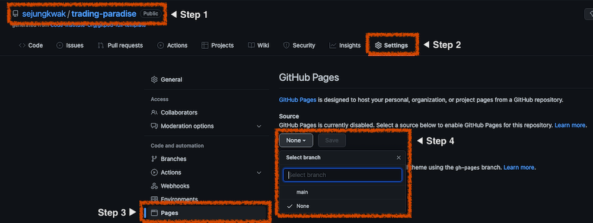

# Trading Paradise Website

_Trading Paradise_ is a marketplace for the [Animal Crossing: New Horizons (ACNH)](https://en.wikipedia.org/wiki/Animal_Crossing:_New_Horizons) player. The site will be targeted towards other ACNH players who are interested in trading in-game items and have [Nintendo Switch online membership](https://www.nintendo.com/switch/online-service/). The main goal of this website is for users to contact _Trading Paradise_ for trading in-game items. It is designed to be responsive and accessible on a range of devices.


### View the live project [here](https://sejungkwak.github.io/trading-paradise/)

<br>

# Table of Contents

[User Experience (UX)](#user-experience-ux)
  - [User Stories](#user-stories)
  - [Design](#design)
  - [Wireframes / Mockups](#wireframes--mockups)

[Features](#features)
  - [Implemented Features](#implemented-features)
  - [Features Left to Implement](#features-left-to-implement)

[Technologies Used](#technologies-used)

- [Languages](#languages)
- [Programs](#programs)

[Testing](#testing)

- [Testing User Stories](#testing-user-stories-from-user-experience-ux-section)
- [W3C Validation](#w3c-validation)
- [Functionality Testing](#functionality-testing)
- [Performance Testing](#performance-testing)
- [Bugs](#bugs)

[Deployment](#deployment)

- [Github Pages](#github-pages)
- [Making a Local Clone](#making-a-local-clone)
- [Forking this Repository](#forking-this-repository)

[Credits](#credits)

- [Code](#code)
- [Content](#content)
- [Images](#images)
- [Inspiration](#inspiration)

<br>

# User Experience (UX)

## User Stories

- As a First Time Visitor,

  - I want to know what this site is about immediately, so that I can quickly decide whether I want to explore it more.
  - I want to be able to navigate pages easily, so that I don't have to waste my time.
  - I want to check their social media, so that I can determine whether they are trustworthy.
    
- As a Returning Visitor,

  - I want to see the site on my phone nicely, so that I can visit it on my way home on the bus.
  - I want to know easily if items that I want to buy are available, so that I don't have to browse the whole page.
  - I want to be able to contact them, so that I can ask questions before trading.

- As a Frequent User,

  - I want to be friends with them, so that I can participate in more events and shooting star wishes.
  - I want to get notified when there are updates on available items, so that I can get them before someone else.
  - I want to be able to add items to my wish list, so that I can find them faster at a later date.

<br>

## Design

The site is designed to look familiar to ACNH. Users can be more comfortable with familiar environments, which will let them stay on the site longer and be more likely to end up trading. Colours, typography and images are chosen with that in mind.

- Colour Scheme
  - Colours are adopted from speech bubbles in the game.

    
  
    - Background colours: #fffae4(Cornsilk), #feed9f(Green Yellow Crayola)
    - Text colour: #5e5450(Umber)
    - Accent colour: #fea600(Chrome Yellow)

  - Each hex colour code was found the following steps:

    1.  Take a screenshot on the game screen.
    2.  Go to [HTML Color Codes](https://html-color-codes.info/colors-from-image/)
    3.  Place the mouse cursor where desired colours are.

    

    4.  Get hex codes.
    5.  Go to [WebAIM Contrast Checker](https://webaim.org/resources/contrastchecker/).
    6.  Check the contrast between background and text and adjust the lightness of the text colour for the accessibility purpose.
    
    

- Typography

  - Fonts are adopted from the [ACNH official website](https://www.animal-crossing.com/new-horizons/) instead of in-game fonts due to licence fee.
    - Headings: [Zilla Slab](https://fonts.google.com/specimen/Zilla+Slab) is used with Serif as the fallback font. It is characterised by bold appearance and smooth curves, so it looks more contemporary and joyful than other serif types.
    - Paragraph: [Libre Franklin](https://fonts.google.com/specimen/Libre+Franklin) is used in body text with Sans Serif as the fall back. It is often perceived as more friendly and warmer than other sans serif types.
  - Fonts on the ACNH official website are identified by Chrome extension [WhatFont](https://chrome.google.com/webstore/detail/whatfont/jabopobgcpjmedljpbcaablpmlmfcogm) and Chrome developer tool.

- Imagery

  - Using ACNH imagery is important to make users comfortable by being similar to ACNH, whereas having unrelated imagery would be confusing.
  - Game Characters are used on the Home, About, Success and 404 page.
  - Item images are used on the Items page to help users recognise items easily even if they don't know the exact name.
  - A leaf pattern background is used throughout the site. The green leaf is representing an item when it's on the ground.

- Logo

  - The logo has the website name _Trading Paradise_ inside the Nintendo Switch console image.
  - The user will recognise the console in the logo by its shape and colour.

    

- Favicon

  - The favicon has the Nintendo Switch joy-cons in the same shape and colour as the logo.

    

<br>

## Wireframes / Mockups
- Mobile
  - [View Wireframes](DESIGN.md/#mobile-wireframes)
  - [View Mockups](DESIGN.md/#mobile-mockups)
  
- Tablet
  - [View Wireframes](DESIGN.md/#tablet-wireframes)
  - [View Mockups](DESIGN.md/#tablet-mockups)
  
- Desktop
  - [View Wireframes](DESIGN.md/#desktop-wireframes)
  - [View Mockups](DESIGN.md/#desktop-mockups)

[Back To **Table of Contents**](#table-of-contents)

<br>

# Features

## Implemented Features

The site features a fully responsive design and contains 4 main pages(Home, About, Items, Contact) and 2 supporting pages(Success, 404). The header and footer are identical across the site.

- Header

  

  - The header is fixed to the top of the screen even when the user is scrolling down the page to allow easier navigation.
  - The logo is linked to the Home page and each menu item is linked to each page on the site to allow easier navigation.
  - A menu item is highlighted as the user browses the site to verify where they are currently.
  - The navigation menu collapses on small devices less than 768px width to optimise the menu for smaller screen sizes.

    

- Footer

  

  - The footer includes links to the relevant social media sites such as _Discord_, _Facebook_, _Instagram_, _Twitter_ to allow the user to check the _Trading Paradise_'s reputation.
  - The links open in a new tab to allow the user to return to _Trading Paradise_ more easily.

- Home page
  - This page contains the hero and feature section.
  - Hero section

      

    - This section contains a screenshot of ACNH characters' greetings with a text overlay to allow the user to understand the purpose of the site at a glance.
    - This section provides a button to the Items page for quick access.
  - Feature section
  
      

    - This section includes brief information about _Trading Paradise_ to assure the user _Trading Paradise_ is an experienced and reliable trader.
    - Smaller screen sizes(less than 768px) show each NPC(animal) image in a single column to optimise the layout.

- About page

  

  - This page provides information about _Trading Paradise_: Who we are, How we started, and What else we do.
  - Two buttons are positioned in optimal locations to catch the user's attention as the content flows.
  - Smaller screen sizes(less than 768px) show each section in a single column to optimise the layout.

- Items page
  - This page contains menu buttons, trading guide, contact box and item list which are organised by trading types: Buy, Sell, Giveaway.

  - Menu buttons

    

    - The menu buttons stay at the top of the main content and right below the header to allow easier navigation.
    - The user is directed to one of the lists by clicking the associated button without having to scroll down.

  - Trading guide

      
  
    - This provides the user clear instructions on how to trade items with _Trading Paradise_.

  - Item list

    

    - This includes each items’ image, name and price which the user would be highly interested in.
    - Smaller screen sizes(less than 768px) show item containers in two columns and medium screen sizes(between 768px and 1024px) show in three columns to optimise the layout.

  - Contact box

    

    - The box is fixed to the bottom right side of the screen for quick access.
    - It encourages the user to contact _Trading Paradise_ when they have found items they would like to trade.
    - The _Discord_ icon is linked to the _Discord_ channel and opens in a new tab to allow the user to return to _Trading Paradise_ more easily.

- Contact page
  - This page contains a call-to-action carousel and contact form.

  - Call-to-action carousel

    

    - This section features a carousel(slideshow) which catches the user’s attention where it might be overlooked with a simple static text.
    - This encourages the user to contact _Trading Paradise_.

  - The Contact form
  
    
  
    - This form allows the user to submit their name, email address, in-game information and message.
    - The privacy policy is provided to assure the user that protecting their privacy is a high priority for _Trading Paradise_.
    - The message field and the checkbox for the privacy policy are required and show feedback if empty or unchecked.
    - The fields for the name, email address, in-game information (the user's character name, island name and friend code) are not required and show feedback if invalid.
    - Upon clicking the __Send Message__ button, the user is redirected to the Success page.

- Success page

  

  - This page gives feedback to the user when they have successfully submitted their information via the contact form.
  - It includes a button to the Home page for quick access.

- 404 page

  

  - This page gives feedback to the user when they try to access nonexistent pages on my site.
  - It includes a button to the Home page for quick access.

<br>

## Features Left to Implement

This project is written in HTML5 and CSS3, so it does not have all the features that I would like to include.

- The form on the Contact page
  
  The form does not send the user data anywhere since I assigned `success.html` to the `action` attribute. The form is a placeholder until the back-end is implemented.

- Adding items into a user's wish list

  Users can not store their data at this stage. This feature is unavailable until the back-end is implemented.

  > As a Frequent User, I want to be able to add items to my wish list, so that I can find them faster at a later date.

- Internal chat system
  
  Users are invited to the Discord channel to communicate in real-time with _Trading Paradise_ at the moment. An internal communication channel will allow users to communicate directly via the site without having to sign up for a new app or even visiting another site. However, I have focused on front-end development on this project and am not confident building a back-end yet. I would like to implement an internal chat system when I am more comfortable.

[Back To **Table of Contents**](#table-of-contents)

<br>

# Technologies Used

## Languages

- [HTML5](https://en.wikipedia.org/wiki/HTML5) was used to present and structure content.
- [CSS3](https://en.wikipedia.org/wiki/CSS) was used to style content.

<br>

## Programs

- [Am I Responsive](http://ami.responsivedesign.is/) was used to create the image showing a responsive design.
- [Balsamiq](https://balsamiq.com/) was used to create the wireframes.
- [Canva](https://www.canva.com/en_gb/) was used to create the logo and favicon.
- [Chrome DevTools](https://developer.chrome.com/docs/devtools/) was used to view the site's styling during development and to check runtime performance.
- [favicon.io](https://favicon.io/) was used to create the favicon.
- [Figma](https://www.figma.com/) was used to create the mockups.
- [Font Awesome](https://fontawesome.com/) was used for the responsive hamburger menu icons as well as social media icons in the footer.
- [GIPHY](https://giphy.com/) was used to convert video files to gifs for the README.
- [Git](https://git-scm.com/) was used for version control.
- [GitHub](https://github.com/) was used to store and deploy the project's code.
- [Gitpod](https://www.gitpod.io/) was used to develop and test my code.
- [Google Fonts](https://fonts.google.com/) was used to import Zilla Slab and Libre Franklin into the style.css file.
- [Pixlr](https://pixlr.com/e/) was used to create the hero image on the Home page.
- [Privacy Policy Generator](https://www.privacypolicygenerator.info/) was used to generate the privacy policy.
- [Removebg](https://www.remove.bg/) was used to remove the background of the ACNH characters image for the hero image on the Home page.
- [TinyPNG](https://tinypng.com/) was used to compress the leaf pattern background images.
- [Upscalepics](https://upscalepics.com/) was used to enhance the quality of the ACNH characters image for the hero image on the Home page.
- [Visual Studio Code](https://code.visualstudio.com/) was used to edit my code and create svg paths from svg image files.
- [W3C CSS Validation Service](https://jigsaw.w3.org/css-validator/) was used to check the CSS validity.
- [W3C Markup Validation Service](https://validator.w3.org/) was used to check the HTML markup validity.
- [WAVE](https://wave.webaim.org/) was used to evaluate the accessibility.
- [WebAIM Contrast Checker](https://webaim.org/resources/contrastchecker/) was used to check the contrast ratio between the background colour and the font colour.

[Back To **Table of Contents**](#table-of-contents)

<br>

# Testing

## Testing User Stories from User Experience (UX) Section

- As a First Time Visitor,

  > I want to know what this site is about immediately, so that I can quickly decide whether I want to explore it more.
  
  : Upon entering the site, users are automatically greeted with an image that is from _ACNH_, and a text overlay that says “Welcome to Trading Paradise - Animal Crossing: New Horizons Marketplace”.
  > I want to be able to navigate pages easily, so that I don't have to waste my time.
  
  : At the top of each page there is a clean navigation bar and each link name describes what page the user will end up at clearly.
  > I want to check their social media, so that I can determine whether they are trustworthy.
  
  : At the bottom of each page there is a footer with relevant social media site links such as _Discord_, _Facebook_, _Instagram_, _Twitter_.

- As a Returning Visitor,

  > I want to see the site on my phone nicely, so that I can visit it on my way home on the bus.
  
  : The site features a fully responsive design. On small devices less than 768px width, the navigation menu collapses and content stacks vertically to optimise the layout.
  > I want to know easily if items that I want to buy are available, so that I don't have to browse the whole page.
  
  : On the Items page, there are three menu buttons: __Sell__, __Buy__, __Giveaway__. The user is directed to one of the item lists by clicking the associated button without having to scroll down.
  > I want to be able to contact them, so that I can ask questions before trading.
  
  : On the Contact page, the user can freely write their message as there is no letter  length limitation in the text area.

- As a Frequent User,

  > I want to be friends with them, so that I can participate in more events and shooting star wishes.
  
  : User can submit their Friend code via the contact form.
  > I want to get notified when there are updates on available items, so that I can get them before someone else.
  
  : In the contact form, there is an updates notification checkbox (“I would like to receive updates via Email”) for the user to tick.
  > I want to be able to add items to my wish list, so that I can find them faster at a later date.
  
  : This feature has not been implemented as this project is written in HTML5 and CSS3. It will be available when the back-end is implemented.

<br>

## W3C Validation

- HTML Validation
  - No errors or warnings were found when passing through the [W3C Markup Validator](https://validator.w3.org/).
  - [View details](VALIDATION.md)

- CSS Validation
  - No errors or warnings were found when passing through the [W3C CSS Validator](https://jigsaw.w3.org/css-validator/).
  - [View details](VALIDATION.md)

<br>

## Functionality Testing

<br>

## Performance Testing

- [Lighthouse in Chrome DevTools](https://developers.google.com/web/tools/lighthouse)
  - I have measured the performance, accessibility, best practices, SEO using Lighthouse in incognito mode.
  - Mobile

    | Page\Category | Performance | Accessibility | Best practices | SEO |
    | :-------------: | :---------: | :-----------: | :------------: | :-: |
    |      Home       |     94      |      100      |      100       | 100 |
    |      About      |     99      |      100      |      100       | 100 |
    |      Items      |     99      |      100      |       92       | 100 |
    |     Contact     |     99      |      100      |      100       | 100 |
    |     Success     |     99      |      100      |       92       | 100 |
    |       404       |     99      |      100      |      100       | 100 |


    - [View details](PERFORMANCE.md)

  <br>

  - Desktop

    | Page\Category | Performance | Accessibility | Best practices | SEO |
    | :-------------: | :---------: | :-----------: | :------------: | :-: |
    |      Home       |     100     |      100      |      100       | 100 |
    |      About      |     100     |      100      |      100       | 100 |
    |      Items      |     100     |      100      |      100       | 100 |
    |     Contact     |     100     |      100      |      100       | 100 |
    |     Success     |     100     |      100      |      100       | 100 |
    |       404       |     100     |      100      |      100       | 100 |

    - [View details](PERFORMANCE.md)

<br>

## Bugs

### Fixed Bugs

- The Header on small devices less than 768px width
  - Error: I was redirected to the Home page when clicking in the middle of the header bar.
  
    
  - Reason: The `header` element has two child elements: `a`(the logo) and `nav`(the navigation menu). A flex layout is used for the `header` and the `column` value is set to the `flex-direction`. The `a` element was taking up the whole header bar except the toggle button space. 
  - Fix: I Added an `align-self: flex-start;` declaration to the `a` element.
  - [View Commit Details](https://github.com/sejungkwak/trading-paradise/commit/70640afad5c6fb76f477b9d511fcd0cde9eb9106)

- Colour Contrast on the Header
  - Error: [WAVE](https://wave.webaim.org/) detected a colour contrast error on the header between the background colour and the accent colour that indicated the current page.

    
  - Reason: I only checked the contrast ratio of the main background colour and text colour when I commenced this project. The header background colour(#FEED9F) and the accent colour(#FEA600) had a very low colour contrast ratio of 1.67:1.
  - Fix: I changed the style of the menu item that indicates the current page to a background colour with greater contrast. I also removed the accent colour for the hover effect to ensure the best accessibility.

    
  - [View Commit Details](https://github.com/sejungkwak/trading-paradise/commit/5e268d1149cb078aebffd727755775481047b976)

- Jump links on the Items page
	- Error: The trading type headings(“Sell”/”Buy”/”Giveaway”) went behind the header when clicking the trading type menu button.

      
	- Reason: I did not consider the height of the header and the menu for the Items page.
	- Fix: I added the `scroll-margin-top` property to the trading type container.
  - [View Commit Details](https://github.com/sejungkwak/trading-paradise/commit/4d12f06f0b121dfd135523546d8d11e287024601)

- Horizontal overflow
  - Error: A horizontal overflow error on the Contact page was identified when adjusting the size of the screen.

    

  - Reason: I used `before` and  `after` pseudo elements to make the background colour wider than the element’s maximum width and assigned `absolute` to its position. However, I did not add a `relative` value to its parent element.
  - Fix: I assigned a `position: relative;` declaration to the `contact-form` selector.
  - [View Commit Details](https://github.com/sejungkwak/trading-paradise/commit/523107e17d593d210ae1d9f92b515e5430ed3525)

<br>

### Known Bugs

- Federated Learning of Cohorts (FLoC)
  - There is an error message: `Error with Permissions-Policy header: Unrecognized feature: 'interest-cohort'.` in the console in Chrome, Opera and Edge. This appears because _GitHub Pages_ has disabled Federated Learning of Cohorts(FLoC) which is an API for gathering users’ data.

    

  - I have found more information about FLoC in the following documents: 
    - WICG’s [FLoC repository](https://github.com/WICG/floc)
    - [Federated Learning of Cohorts (FLoC)](https://docs.gitlab.com/ee/user/admin_area/settings/floc.html) on [GitLab Docs](https://docs.gitlab.com/)
    - [GitHub Pages: Permissions-Policy: interest-cohort=() Header added to all pages sites](https://github.blog/changelog/2021-04-27-github-pages-permissions-policy-interest-cohort-header-added-to-all-pages-sites/) on [GitHub Changelog](https://github.blog/changelog/)
  - According to _GitHub Pages_, FLoC has been disabled to avoid users being tracked and categorised. As the Chrome DevTools Lighthouse does not report any negative performance issues, I have decided not to pursue any further.

[Back To **Table of Contents**](#table-of-contents)

<br>

# Deployment

## GitHub Pages

The site was deployed to _GitHub Pages_ using the following steps:

  1. Navigate to [my GitHub Repository](https://github.com/sejungkwak/trading-paradise).
  2. Click the __Settings__ button on the menu.
  3. Select __Pages__ from the left side vertical menu.
  4. Under __Source__, click the dropdown called __None__ and select __main__.

  

  5. Click the __Save__ button.

  

  6. The page is automatically refreshed with a bar which shows the status and live link.

  

  7. Refresh the page. The bar turns green to indicate the successful deployment.

  

The live link can be found here - https://sejungkwak.github.io/trading-paradise/

<br>

## Making a Local Clone
These steps demonstrate how I cloned my repository to create a local copy on my computer to run the code locally.

  1. Navigate to [my GitHub Repository](https://github.com/sejungkwak/trading-paradise).
  2. Click the __Code__ button above the list of files.

  

  3. Select __HTTPS__ under __Clone__. I have chosen this option as it is simpler than SSH.
  4. Click the copy icon on the right side of the URL.

  

  5. Open the Terminal.
  6. Change the current working directory to the location where I want the cloned directory.
  7. Type `git clone ` and then paste the URL I copied in step 4.
  
  ```
  $ git clone https://github.com/sejungkwak/trading-paradise.git
  ```

  

  8. Press enter. Messages are displayed in the Terminal to indicate the local clone has been successfully created.

  

<br>

## Forking this Repository
These steps demonstrate how to make a copy of this repository on your GitHub account to make changes without affecting this repository or to deploy the site yourself.

  1. Log in to your GitHub account.
  2. Navigate to [this Trading Paradise repository](https://github.com/sejungkwak/trading-paradise).
  3. Click the __fork__ button* on the top right side of the repository.

  *The button in the image is disabled since the repository belongs to me. It should be active if you logged on your account.

  

  3. You should now have a copy of the original repository in your GitHub account.
  4. You can make a local clone from the copied repository on your computer using the steps demonstrated in [Making a Local Clone](#making-a-local-clone) and/or deploy to _GitHub Pages_ using the steps demonstrated in [GitHub Pages](#github-pages).

[Back To **Table of Contents**](#table-of-contents)

<br>

# Credits

## Code

- Responsive hamburger menu navigation bar
  - Source: Kevin Powell's YouTube video [Create a responsive navigation nav with no JS!](https://www.youtube.com/watch?v=8QKOaTYvYUA&t=1402s) and [his code on Codepen](https://codepen.io/kevinpowell/pen/jxppmr)
    - Using the `input checkbox` and the `label` element for the responsive navigation bar 
    - Using the `transform` property instead of the `display` property to apply the transition in CSS
  - I have used this technique to make hamburger menu navigation bar on small devices less than 768px width.
- Full brower width bars
  - Source: Chris Coyier's CSS-TRICKS article [Full Browser Width Bars](https://css-tricks.com/full-browser-width-bars/)
    - Using `before` and `after` pseudo elements for making background colour wider than maximum width of the element  
  - I have used this technique to make the header, trade guide, item list and contact form's background colour wider than 1400px, which I have set as the maximum width of the site.
- Sticky footer
	- Source:  Kevin Powell's YouTube video [Easy sticky footer - stop a footer from floating up a short page!](https://www.youtube.com/watch?v=yc2olxLgKLk) and the Gábor Móczik's comment on the video
		- Using a `flex` property(to the main) and a `justify-self` property(to the footer) makes the footer fixed at the bottom of the screen even when there is not enough content on the page.
  - I have used this technique to make a sticky footer across the site.
- Fixed header and jump links
	- Source: Chris Coyier's CSS-TRICKS article [Fixed Headers and Jump Links? The Solution is scroll-margin-top](https://css-tricks.com/fixed-headers-and-jump-links-the-solution-is-scroll-margin-top/)
      - Using a `scroll-margin-top` property to the linked element makes the whole linked content visible.
  - I have used this technique for the menu buttons on the Items page.
- Vertical carousel
	- Resource:  Ziratsu's CSS Carousel(https://codepen.io/Ziratsu/pen/ZEKWaRv)
      - Using an animation that scrolls through a number of words in a carousel format.
	- I have used this technique to create a slideshow on the Contact page.
- Refactoring
  - HTML attribute order
	  - Source: [Principles of writing consistent, idiomatic HTML](https://github.com/necolas/idiomatic-html)
	  - With the guidance of the above content, I have organised HTML attributes in this order: 1. class / 2. id / 3. href / 4. src / 5. target / 6. rel / 7. type / 8. name / 9. for / 10. alt / 11. role / 12. aria
  - CSS property order
	  - Source: 9Elements’ [How to organize CSS](https://9elements.com/css-rule-order/#:~:text=So%20the%20order%20is%3A%20position,text%2D*%20%2C%20then%20word%2D*%20.)
	  - With the guidance of the above content, I have organised CSS properties by type as follows: 1. `content` property / 2. position and layout / 3. display and visibility / 4. clipping / 5. box model / 6. background / 7. typography / 8. animation and transition
- 404 page
  - Source: [GitHub Docs](https://docs.github.com/en/pages/getting-started-with-github-pages/creating-a-custom-404-page-for-your-github-pages-site)
    - Using a filename `404.html` makes a 404 error page display when the user tries to access nonexistent pages on my site.


## Content

- I have used the README structure from Code Institute Solutions’ templates: [SampleREADME](https://github.com/Code-Institute-Solutions/SampleREADME) and [readme-template](https://github.com/Code-Institute-Solutions/readme-template).
- I have found information about the island name length limitation of ACNH on [Animal Crossing World](https://animalcrossingworld.com/2020/03/10-character-island-names-confirmed-in-animal-crossing-new-horizons-opening-day-tutorial-details/). This information was used in the Contact page to create the island name validation.
- I have used a privacy policy generated by [Privacy Policy Generator](https://www.privacypolicygenerator.info/).
- I have found information about Libre Franklin font on [Hackernoon](https://hackernoon.com/tips-about-using-libre-franklin-a-versatile-font-for-friendly-brands-mo2t34hn). This information was used in the README.
- I have found information about cloning and forking a repository from these documents: [Fork a repo
](https://docs.github.com/en/get-started/quickstart/fork-a-repo) and [Cloning a repository](https://docs.github.com/en/repositories/creating-and-managing-repositories/cloning-a-repository) on [GitHub Docs](https://docs.github.com/en) and [Deployment](https://github.com/Code-Institute-Solutions/SampleREADME#deployment) section of Code Institute’s [sample README](https://github.com/Code-Institute-Solutions/SampleREADME). This information were used in the README.

## Images

- The leaf background image was sourced from [Devinatart](https://www.deviantart.com/jotaauvei/art/Nook-Inc-Wallpaper-Collection-827180686).
- Animal character images were sourced from [Fandom](https://www.fandom.com/).

  - in order of appearance on the website
    - [Tom Nook](https://animalcrossing.fandom.com/wiki/Tom_Nook?file=NH-character-Tom_Nook.png): The raccoon on the Home page
    - [Daisy Mae](https://animalcrossing.fandom.com/wiki/Daisy_Mae?file=Daisy_Mae_NH.png): The boar on the Home page
    - [Tortimer](https://animalcrossing.fandom.com/wiki/Tortimer?file=Tortimer_NLa.png): The tortoise on the Home page
    - [Pascal](https://animalcrossing.fandom.com/wiki/Pascal?file=Pascal-NH.png): The otter on the Success page
    - [Redd](https://animalcrossing.fandom.com/wiki/Animal_Crossing:_City_Folk/Gallery?file=Redd.png): The fox on the 404 page

- All the item images on the Items page were sourced from [this spreadsheet](https://docs.google.com/spreadsheets/d/1mo7myqHry5r_TKvakvIhHbcEAEQpSiNoNQoIS8sMpvM/edit#gid=1397507627) which is hosted on [Norviah's repository: acnh-images](https://github.com/Norviah/acnh-images).

  - in order of appearance on the website
    - [Adventure dress](https://docs.google.com/spreadsheets/d/1mo7myqHry5r_TKvakvIhHbcEAEQpSiNoNQoIS8sMpvM/edit#gid=714704098): Row 5 / Column B in the file.
    - [Bell bag](https://docs.google.com/spreadsheets/d/1mo7myqHry5r_TKvakvIhHbcEAEQpSiNoNQoIS8sMpvM/edit#gid=1026478546): Row 13 / Column B in the file.
    - [Nook miles ticket](https://docs.google.com/spreadsheets/d/1mo7myqHry5r_TKvakvIhHbcEAEQpSiNoNQoIS8sMpvM/edit#gid=1026478546): Row 145 / Column B in the file.
    - [Astronaut suit](https://docs.google.com/spreadsheets/d/1mo7myqHry5r_TKvakvIhHbcEAEQpSiNoNQoIS8sMpvM/edit#gid=1124134982): Row 66 / Column B in the file.
    - [Bonsai shelf](https://docs.google.com/spreadsheets/d/1mo7myqHry5r_TKvakvIhHbcEAEQpSiNoNQoIS8sMpvM/edit#gid=1124134982): Row 218 / Column B in the file.
    - [Campsite sign](https://docs.google.com/spreadsheets/d/1mo7myqHry5r_TKvakvIhHbcEAEQpSiNoNQoIS8sMpvM/edit#gid=1124134982): Row 302 / Column B in the file.
    - [Cherry's photo](https://docs.google.com/spreadsheets/d/1mo7myqHry5r_TKvakvIhHbcEAEQpSiNoNQoIS8sMpvM/edit#gid=1076410742): Row 642 / Column B in the file.
    - [Cinnamoroll stool](https://docs.google.com/spreadsheets/d/1mo7myqHry5r_TKvakvIhHbcEAEQpSiNoNQoIS8sMpvM/edit#gid=1124134982): Row 408 / Column B in the file.
    - [Cinnamoroll tray](https://docs.google.com/spreadsheets/d/1mo7myqHry5r_TKvakvIhHbcEAEQpSiNoNQoIS8sMpvM/edit#gid=425288018): Row 190 / Column B in the file.
    - [Familiar statue](https://docs.google.com/spreadsheets/d/1mo7myqHry5r_TKvakvIhHbcEAEQpSiNoNQoIS8sMpvM/edit#gid=2038580021): Row 17 / Column B in the file.
    - [Heart-shaped bouquet](https://docs.google.com/spreadsheets/d/1mo7myqHry5r_TKvakvIhHbcEAEQpSiNoNQoIS8sMpvM/edit#gid=425288018): Row 490 / Column B in the file.
    - [Nuptial ring pillow](https://docs.google.com/spreadsheets/d/1mo7myqHry5r_TKvakvIhHbcEAEQpSiNoNQoIS8sMpvM/edit#gid=425288018): Row 852 / Column B in the file.
    - [Ancient statue](https://docs.google.com/spreadsheets/d/1mo7myqHry5r_TKvakvIhHbcEAEQpSiNoNQoIS8sMpvM/edit#gid=2038580021): Row 6 / Column B in the file.
    - [Beautiful statue](https://docs.google.com/spreadsheets/d/1mo7myqHry5r_TKvakvIhHbcEAEQpSiNoNQoIS8sMpvM/edit#gid=2038580021): Row 10 / Column B in the file.
    - [Gallant statue](https://docs.google.com/spreadsheets/d/1mo7myqHry5r_TKvakvIhHbcEAEQpSiNoNQoIS8sMpvM/edit#gid=2038580021): Row 21 / Column B in the file.
    - [Great statue](https://docs.google.com/spreadsheets/d/1mo7myqHry5r_TKvakvIhHbcEAEQpSiNoNQoIS8sMpvM/edit#gid=2038580021): Row 26 / Column B in the file.
    - [Informative statue](https://docs.google.com/spreadsheets/d/1mo7myqHry5r_TKvakvIhHbcEAEQpSiNoNQoIS8sMpvM/edit#gid=2038580021): Row 27 / Column B in the file.
    - [Mystic statue](https://docs.google.com/spreadsheets/d/1mo7myqHry5r_TKvakvIhHbcEAEQpSiNoNQoIS8sMpvM/edit#gid=2038580021): Row 37 / Column B in the file.
    - [Robust statue](https://docs.google.com/spreadsheets/d/1mo7myqHry5r_TKvakvIhHbcEAEQpSiNoNQoIS8sMpvM/edit#gid=2038580021): Row 44 / Column B in the file.
    - [Valiant statue](https://docs.google.com/spreadsheets/d/1mo7myqHry5r_TKvakvIhHbcEAEQpSiNoNQoIS8sMpvM/edit#gid=2038580021): Row 60 / Column B in the file.
    - [Animal city](https://docs.google.com/spreadsheets/d/1mo7myqHry5r_TKvakvIhHbcEAEQpSiNoNQoIS8sMpvM/edit#gid=1055239961): Row 4 / Column B in the file.
    - [Candy](https://docs.google.com/spreadsheets/d/1mo7myqHry5r_TKvakvIhHbcEAEQpSiNoNQoIS8sMpvM/edit#gid=1026478546): Row 50 / Column B in the file.
    - [Fish pochette](https://docs.google.com/spreadsheets/d/1mo7myqHry5r_TKvakvIhHbcEAEQpSiNoNQoIS8sMpvM/edit#gid=1695977424): Row 30 / Column B in the file.
    - [Fossil](https://docs.google.com/spreadsheets/d/1mo7myqHry5r_TKvakvIhHbcEAEQpSiNoNQoIS8sMpvM/edit#gid=1026478546): Row 94 / Column B in the file.

- Images that were not mentioned above were created by me.

<br>

## Inspiration

- Item layout
  - Each item is in a separate item container. Each container has an item image, name and price with the bell and nook mile ticket image. This layout is from a well-known ACNH trading website [Nookazon](https://nookazon.com/).

- Accessibility
  - As a person who has not experienced any big accessibility issues while using the internet for decades, accessibility related elements or attributes were something that I just used because people said so. In the middle of the development I came across [Seren Davies talk: Death to icon fonts](https://www.youtube.com/watch?v=9xXBYcWgCHA). This talk made me improve the accessibility of my website.
  - I found a lot of useful information on [A11Y Project](https://www.a11yproject.com/) and especially [this checklist](https://www.a11yproject.com/checklist/) was helpful to see what I need to implement to enhance accessibility of my website.
    - I wanted to add a tooltip to each item on the Items page to show the contact information when clicking on each item container. I found a technique using `tabindex` on [Stackoverflow](https://stackoverflow.com/questions/39741709/css-focus-not-working).  
    However, after reading [this post](https://www.a11yproject.com/posts/how-to-use-the-tabindex-attribute/) on A11Y Project and [MDN document](https://developer.mozilla.org/en-US/docs/Web/Accessibility/Keyboard-navigable_JavaScript_widgets), I have learned usage of `tabindex` should be limited to occasions such as managing focus within an interactive widget or a scrollbar of an overflow container.

[Back To **Table of Contents**](#table-of-contents)