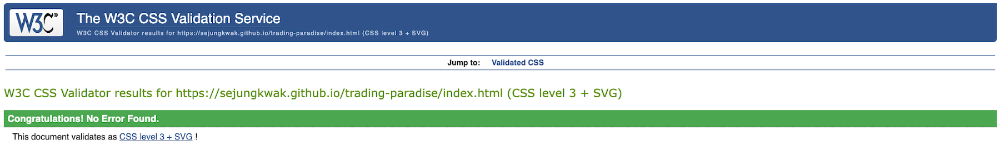
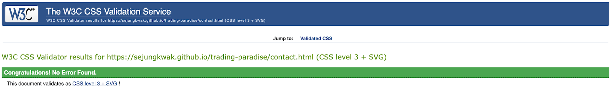

# HTML Validation

## Home page

## About page

## Items page

## Contact page

## Success page

## 404 page

 

# CSS Validation

## Home page

## About page

## Items page

## Contact page

## Success page

## 404 page

    
    
    
    
    
    