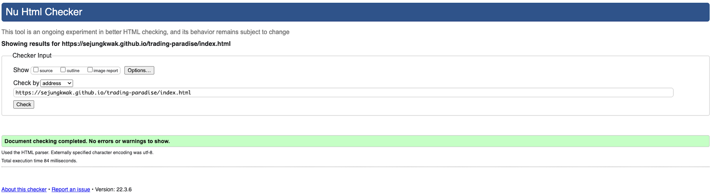

# Table of Contents

- HTML Validation
  - [Home page](#home-page)
  - [About page](#about-page)
  - [Items page](#items-page)
  - [Contact page](#contact-page)
  - [Success page](#success-page)
  - [404 page](#404-page)

- CSS Validation
  - [Home page](#home-page-1)
  - [About page](#about-page-1)
  - [Items page](#items-page-1)
  - [Contact page](#contact-page-1)
  - [Success page](#success-page-1)
  - [404 page](#404-page-1)

 

# HTML Validation

## Home page

## About page

## Items page

## Contact page

## Success page

## 404 page

[Back To **Table of Contents**](#table-of-contents)

 

# CSS Validation

## Home page

## About page

## Items page

## Contact page

## Success page

## 404 page

[Back To **Table of Contents**](#table-of-contents)
    
    
    
    
    